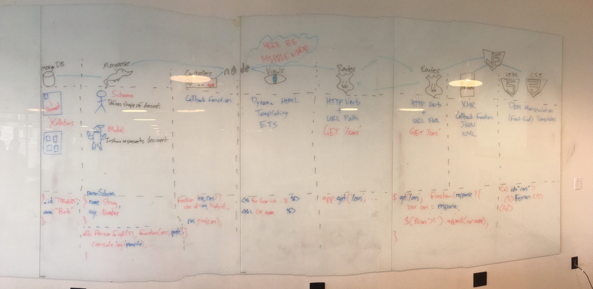

# Developer Resources

## Why is this important?
Google and finding information is often as important as the actual written code. 

## What are the objectives
- **List** the types of common developer internet searches
- **List** some quality websites for information

## Visuals:

They're Big! Click to expand

  

  

  

  

  
  
  

  

## Google Searches: 
[Comment]: # (9:10) 

My types of searches I perfom on a regular basis:
- Documentation offload (20% - 40%)
  - What is the exact argument for a function
  - What is the name in JavaScript or Ruby for the each function
  - How do I do this Ruby thing in JavaScript
  - Difference between status codes
- How to do something small (20% - 40%)
  - Find specific errors (enter the error)
  - Troubleshoot an issue
  - Find a library that does something that I need
- Best practices (<5%)
  - How do you structure API error codes
  - Ideas on how to break up objects
- New technologies (5%-10%)
  - Look for replacements to libraries that are clunky
  - Look for new hotness, Docker, Go 
- Finding a tututorial (< 5%)
  - Learn a new language, framework, or tool

My Google workflow:

1. Type in my initial guess into Google
2. If an autocomplete answer seems better choose that answer
3. Review the top few links to see if there is a source I like in the top list 
4. Read the page in a new tab so I can return to the search results.
5. Return to step 3 until I think I have the wrong search
6. Return to step 1 

[CFU]: # (Ask for other workflows)

## How to Google:

  - Include the language or library you are using
    - For example: "javascript foreach object"

  - Check out the search tools 'past year'

  - Google the exact error:
    - `ReferenceError: alert is not defined`

  - Use quotes to make sure words appear together
    - For example: `"alert is not defined"`

  - site:address.com will restrict searches to just that site
    - For example: `javascript .map returns undefined site:stackoverflow.com`

  - Look for three main kinds of solutions:

    1. Documentation
    2. Stack Overflow and other crowd sourced answers
    3. Blogs
    
  - [More search tips](http://motto.time.com/4116259/google-search/)
  - [Even more search tips](http://www.digitaltrends.com/computing/the-35-best-google-search-tips-and-tricks/)

## Documentation

### Common Errors

There are some errors you will see a lot.  So often in fact that we can internalize what they generally mean to humans.

Here is [a list](https://github.com/den-wdi-2/developer-resources/blob/master/common_errors.md) of those common errors for web developers.

### Javascript

Below is a list of some helpful review sources for Javascript:

1. [Week 1 Second Pass](https://github.com/den-wdi-5/week1_secondPass)
1. [Week 2 Second Pass](https://github.com/den-wdi-4/week2_secondPass)
3. [Week 2 Second Pass Lab](https://github.com/den-materials/wdi5_w2_secondPassLab)
2. [Unit 2 Week 1 Second Pass](https://github.com/den-wdi-2/unit2_week1_secondpass)
3. [Unit 2 Week 2 Second Pass](https://github.com/den-wdi-2/unit2_week2_secondpass)
2. [Anatomy of Code - JS](http://www.anatomyofcode.com/)
5. [Unit 3 Week 1 Second Pass](https://github.com/den-wdi-2/unit3_week1_secondpass)
1. [Unit 3 Week 2 Second Pass](https://github.com/den-wdi-2/unit3_week2_secondpass)

There are many resources that contain Javascript documentation online.  Below are the most popular:

1. [MDN (Mozilla Developer Network)](https://developer.mozilla.org/en-US/docs/Web/JavaScript)
2. [W3Schools (World Wide Web Schools)](http://www.w3schools.com/js/default.asp)

## Stack Overflow
[Comment]: # (9:20) 

[Stack Overflow](http://stackoverflow.com/) is a crowd-sourced answering platform.  If someone has an issue that Google 
can't help them solve, they post on Stack Overflow.  That way, when other people try to search Google for a solution, 
they find one on Stack Overflow.

There are several similar, affiliated Stack Question-and-Answer channels online as well, like 
[SuperUser](http://superuser.com/) for IT questions.

Tip: For more basic questions check down the listing to see if there is a more recent answer.

## Github

If you're looking for help with a medium library, Devise, Passport, Koala, a Ruby facebook gem, etc., or smaller 
library, you might be able to find blogs or Stack Overflow information. However, the best information may be on the 
actual Github page. 

If you get taken to Github issue or wiki page this is often either a very good sign or a very bad 
sign. It's a good sign if there some discussion and a resolved then you may just need to update the library. If there's 
just a description of your bug, good chance for you to maybe earn some open source points.

## "Cheat Sheets"

[This repo](https://github.com/den-materials/WDI-cheat-sheets) has a bunch of useful cheatsheets, generally organized chronologically as we go through class.

## Blogs and Podcasts
[CFU]: # (Ask students for blogs)
[Comment]: # (9:25) 
Many developers and companies that are looking for more social proof or to better their job opportunities by publishing 
blogs. If you're Google results end up a blog you can often find good information.

Some of the companies that have fairly active engineering blogs are:

* [Toptal](https://www.toptal.com/blog)
* [Thoughtbot](https://robots.thoughtbot.com/)

Some engineers will also blog about a nasty bug just to make sure that they have a reference for the future. If you see
a good description and that's the only blog post don't worry that a blog isn't updated frequently.

If you are looking for solid podcasts, these come highly recommended by your Consultants:

* [CodeNewbie](http://www.codenewbie.org/) - This is a great podcast for all levels, and great if you’re looking for stories of people who have struggled and accomplished great things.
* [The Changelog](https://changelog.com/) -  A great podcast to keep you up-to-date on the latest trends with game-changers in the coding industry.  Recommended for people who have a little dev experience.
* [Javascript Jabber](https://devchat.tv/js-jabber) - A small group of rotating hosts bring on experts and get pretty in-depth on JS topics.  Recommended for people who have a little dev experience.

## Conclusion  
[Comment]: # (9:30) 

As a developer often you spend as much time looking for information as typing up code. Don't worry if you're spending a 
lot of time googling as that's a normal part of being a developer and creating quality code()

## Licensing
All content is licensed under a CC­BY­NC­SA 4.0 license.
All software code is licensed under GNU GPLv3. For commercial use or alternative licensing, please contact legal@ga.co.
